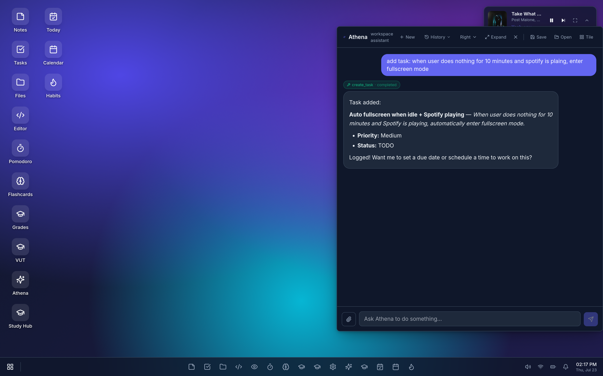
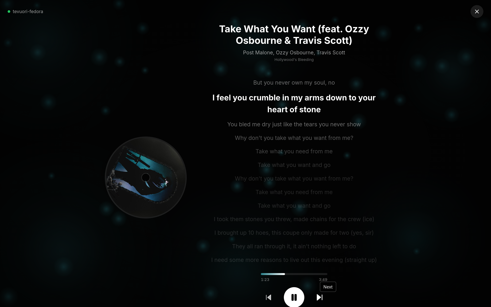
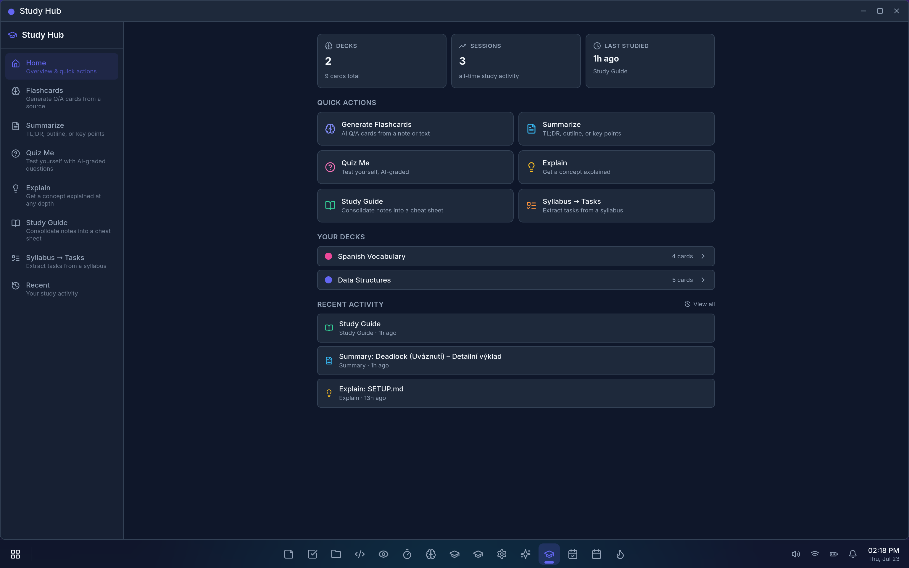
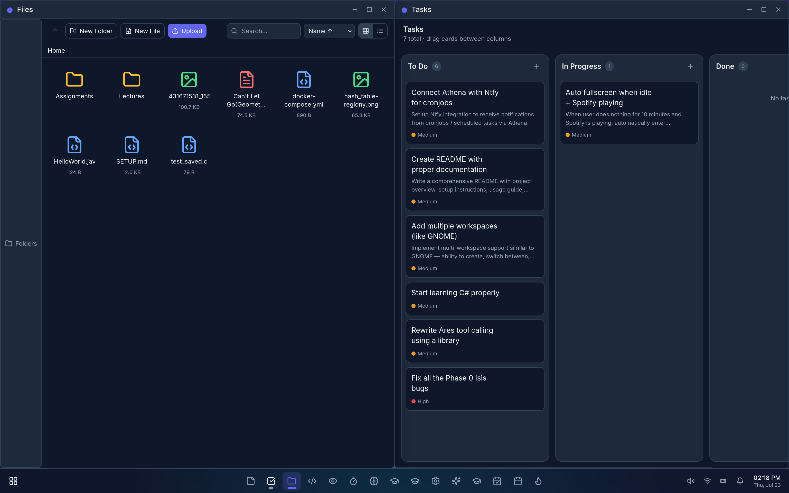

<div align="center">

# Athena — Student OS

**A desktop-environment-style productivity dashboard for students.**

Vite + React 18 · TypeScript · Tailwind CSS 3 · Bun + Hono · Prisma + SQLite · Docker Compose

[Features](#-features) · [Screenshots](#-screenshots) · [Study Hub](#-study-hub) · [Quick Start](#-quick-start) · [Docker](#-docker) · [Project Structure](#-project-structure) · [License](#-license)

</div>

---

## Overview

Athena is a self-hosted, browser-based "operating system" for students. It recreates the feel of a real desktop environment — draggable/resizable windows, a taskbar, start menu, system tray, command palette, and an animated wallpaper — and fills it with a suite of apps built around the academic workflow: notes, tasks, files, a code editor, flashcards, a grade tracker, calendar, habits, a Pomodoro timer, an AI study hub, voice notes with Whisper transcription, and an AI assistant ("Athena").

It also integrates with the services students actually use: **Spotify** (with a beat-reactive fullscreen "Chill" mode), **Microsoft Calendar** (Graph API sync), and **VUT Studis** (Brno University of Technology SSO — grades, timetable, subject updates).

> Default login after seeding: **`admin` / `admin`**

---

## Screenshots

### 1. The desktop, with Spotify and an aurora background

The default environment: animated canvas wallpaper (aurora waves), the compact Spotify music widget in the top-right corner with synced lyrics, desktop icons, and the taskbar.


### 2. Athena assistant

The Athena AI assistant snapped to the right half of the screen, running alongside the desktop. Streaming chat with tool-call chips, powered by the multi-llm-ts backend.



### 3. Chill mode — fullscreen Spotify

The immersive fullscreen music experience: beat-reactive animated canvas background driven by captured system audio, spinning vinyl album art, and large centered synced lyrics. Shown here playing *"Take What You Want"*.



### 4. Study Hub

The AI Study Hub: source-grounded Q&A, interactive Teach Me tutoring, podcasts, flashcards, summaries, quizzes, study guides, syllabus→tasks, and learning workspaces — all built on the Athena LLM infrastructure.



### 5. Files + Tasks, side by side

Two windows snapped side-by-side: the File Manager (virtual FS, tree sidebar, grid/list view) on the left and the Tasks Kanban board on the right — showcasing the window manager's edge-snap tiling.



---

## Features

### Desktop shell

- Animated **boot screen → login → desktop** flow
- **Draggable / resizable windows** with 8 resize handles and open/close/minimize animations
- **Grid snapping** — drag to edges (halves), corners (quadrants), or top (maximize), with a live snap-preview overlay
  - Hold **Shift** while resizing to snap to a 20px grid
  - Keyboard shortcuts (Win/Cmd): `Win+←/→` halves, `Win+↑` maximize, `Win+Shift+↑` toggle maximize, `Win+Shift+←/→` top quadrants, `Win+Shift+↓` minimize, `Win+↓` restore, `Win+W` close, `Win+Y` toggle Athena quick panel
- **Container-query responsive layouts** — each window's content adapts to the *actual window width* (not the viewport); sidebars collapse into toggleable overlays when narrow
- Z-index focus management, **Alt+Tab** switcher (Shift+Alt+Tab for reverse)
- **Taskbar** with running-app indicators, **Start menu** with app search
- **System tray**: clock, volume slider, notifications bell, DND toggle, mini-calendar
- Desktop right-click **context menu** (New Folder, Change Wallpaper, Animated Background, Refresh) and desktop icons for pinned apps
- **Settings**: light/dark theme, accent color, wallpaper picker, account, notification preferences
- **14 animated backgrounds** (starfield, particle network, matrix rain, neon grid, aurora waves, ocean waves, bubbles, geometric pulse, fireflies, rain, plasma, constellation, bokeh, snowfall) with category tabs + search; rendered on a `<canvas>` overlay with `requestAnimationFrame`, DPR scaling, and cleanup on unmount

### Apps

| # | App | Highlights |
|---|-----|-----------|
| 1 | **Notes** | Markdown editor with live preview, CodeMirror 6 split view, full LaTeX via KaTeX (`$...$` / `$$...$$`), folders, tags, search, debounced auto-save, pin, export to Markdown/PDF |
| 2 | **Tasks** | Kanban board (To Do / In Progress / Done) with drag-and-drop, priority tags, due dates |
| 3 | **File Manager** | Virtual FS: 3-pane layout, folder tree + smart collections (Home/Recent/Starred/All), grid & list views, multi-select, bulk ZIP, copy/cut/paste, drag-drop move & upload, context menus, quick-look panel, storage usage bar |
| 4 | **Code Editor** | CodeMirror 6 with syntax highlighting for 40+ languages, markdown live-preview, debounced auto-save, Ctrl+S, word-wrap, light/dark theme, status bar, dirty-state indicator |
| 5 | **File Viewer** | Image zoom/pan/fit/1:1/fullscreen, PDF iframe, audio & video players, download fallback |
| 6 | **Music Widget** | Compact Spotify overlay polling the active device every 3s, synced lyrics (LRCLIB), click-to-seek, expandable lyrics panel, **Chill mode** fullscreen experience with beat-reactive canvas (Web Audio `AnalyserNode` on captured system audio), spinning vinyl, glow lyrics, spacebar play/pause |
| 7 | **Pomodoro / Focus Timer** | Circular SVG ring, 25/5/15 intervals, auto long-break after 4 sessions, Web Audio chime, auto-DND during focus, daily stats |
| 8 | **Flashcards** | SM-2 spaced repetition, deck browser with color tags, card CRUD, 3D flip-card review, 4-level quality rating, due-date scheduling |
| 9 | **Grade Tracker** | Course management with semester filtering, weighted assignment categories, credit-weighted GPA on 4.0 scale, letter-grade conversion, animated bars |
| 10 | **VUT Studis** | BUT integration: encrypted SSO (AES-256-GCM), Overview / Grades / Timetable / Updates / Web View tabs, HTML parsing with cheerio, "Import to Grade Tracker" |
| 11 | **Settings** | Theme, wallpaper, animated backgrounds, accent, account, notifications, AI provider (key + provider/baseURL/model) |
| 12 | **Study Hub** | AI-powered study center: source-grounded Q&A, interactive Teach Me tutoring, podcasts, flashcards, summaries, quizzes, study guides, syllabus→tasks, learning workspaces — see [Study Hub](#-study-hub) below |
| 13 | **Calendar / Planner** | Month/week/day views, ICS import/export, task drag-to-schedule, Microsoft Graph sync |
| 14 | **Habits** | Streaks, heatmap, auto-complete from Pomodoro sessions |
| 15 | **Athena assistant** | Streaming chat UI with tool-call chips (SSE), multi-llm-ts backend, system prompt + tool plugins, `Win+Y` quick panel |
| 16 | **Voice Notes** | Microphone recorder (MediaRecorder + Web Audio level meter), Whisper transcription via the OpenAI-compatible API, LLM cleanup pass (punctuation, paragraphs, smart title), saves audio to the virtual FS and creates a linked Note. Also integrated into Quick Capture (`Ctrl+Shift+N` mic button). Degrades gracefully — audio + placeholder note saved even without transcription |

### Integrations

- **Spotify** — server-side token exchange/refresh, device polling, LRCLIB synced lyrics
- **Microsoft Calendar** — Graph API (`Calendar.ReadWrite` + `offline_access`), automatic refresh-token rotation persisted in DB
- **VUT Studis** — full Shibboleth/SAML SSO with cookie jar + session caching (25min TTL)
- **Athena LLM** — multi-llm-ts client supporting `openai | deepseek | anthropic | openrouter | ollama | groq | mistralai | google | xai | meta | cerebras`; per-user config (encrypted in DB) takes priority over server-wide fallback

---

## Study Hub

The Study Hub is Athena's AI-powered study center — a single app that consolidates every learning workflow around your **sources** (notes, files, pasted text, URLs, Moodle documents). All modes share the same source library and the Athena LLM infrastructure, so you pick what to study from and choose how you want to learn.

### Source library

Everything in the Study Hub starts with **sources**. A source is any text you want Athena to learn from:

- **Notes** — any note from the Notes app (full markdown + LaTeX)
- **Files** — any text-readable file from the File Manager (`.txt`, `.md`, `.py`, `.js`, `.json`, etc.)
- **Pasted text** — ad-hoc text you paste directly (no need to create a note first)
- **URLs** — web pages fetched and extracted server-side (readability-style text extraction)
- **Moodle documents** — documents from your Moodle courses (if VUT Studis is connected)

Sources are cached in the database after first use, so re-using them in different modes is instant. A unified source picker lets you add new sources on the fly from any mode — you don't have to pre-register them.

### Learning workspaces

A **learning workspace** is a named group of sources — think of it as a "course" or "exam topic." Instead of re-picking sources every time you want to study, you group them once and then launch any mode against the workspace.

- **Create** a workspace from Study Hub → Home → "New workspace"
- Give it a **name**, **description**, **color tag**, and pick sources from the library (or add new ones inline)
- Each workspace card has quick-launch buttons for **Ask** (grounded chat) and **Podcast**
- Workspaces are persisted per-user and can be edited or deleted at any time

For example, you might create a workspace called "Calculus II — Final" with your lecture notes, the textbook PDF, and a few relevant URLs. Then one click opens a grounded chat or generates a podcast from all of them.

### Modes

| Mode | What it does |
|------|-------------|
| **Teach Me** | Interactive live tutoring — see [Teach Me](#teach-me-interactive-tutor) below |
| **Ask (grounded)** | Source-grounded Q&A with `[n]` citations. Click a citation to open the source and jump to the passage. Reuses the same citation convention as the main Athena assistant |
| **Podcast** | Generates a 2-host dialogue script from your sources and plays it via the Web Speech API (alternating voices, adjustable speed). The script is saved as a note for download/re-use |
| **Flashcards** | AI-generated Q/A cards from a source, saved to a deck in the Flashcards app with SM-2 scheduling |
| **Summarize** | TL;DR, outline, or key-points summary of a source, saved as a note |
| **Quiz Me** | AI-generated quiz questions from a source, with AI-graded answers and explanations |
| **Explain** | Get a concept explained at any depth (ELI5 → expert), with analogies and examples |
| **Study Guide** | Consolidates multiple sources into a single structured cheat sheet / study guide note |
| **Syllabus → Tasks** | Extracts tasks, deadlines, and readings from a syllabus and creates Tasks board entries |
| **Recent** | Feed of all your study sessions with one-click resume (flashcard review, re-open notes, restart quizzes, resume Teach Me sessions) |

### Teach Me (Interactive Tutor)

The flagship Study Hub mode. **Teach Me** turns Athena into a live, voice-driven tutor that teaches from your sources in real-time — opening apps, scrolling to and highlighting passages, speaking aloud, and checking your understanding as you go.

#### How it works

1. **Pick sources** and set your **level** (beginner / intermediate / advanced)
2. **Ask Athena to teach you** a topic — e.g. "Teach me about gradient descent" or "Explain chapter 3"
3. Athena **teaches conversationally**, citing sources with `[n]` markers
4. As she speaks, she **opens your existing apps and points at the relevant passages**:

| Source type | What happens |
|-----------|--------------|
| **Notes** | Opens the note, scrolls to the passage, highlights it inline (accent-colored decoration) |
| **Code Editor** | Opens the file, highlights specific line ranges |
| **File Viewer** | PDFs: jumps to searched text via PDF Open Parameters; images: zoom-pulse focus; audio/video: seeks to timestamp |
| **Browser** | Opens the URL, scrolls to and highlights text on the live web page via an injected content script |

5. She can also **focus** a previously-shown source (bring it back to front), **close** a source when done, and **clear** highlights before highlighting a new passage
6. The timing is designed so the visual appears *as she says the words* — the LLM decides when to call `show_source` / `highlight_source` right before the sentence that references the passage

#### Voice (TTS + STT)

- **Athena speaks her replies** via **ElevenLabs** (natural neural voice, with character-level timestamps for speech-synced highlighting) or **Web Speech API** fallback if no ElevenLabs key is configured
- **Auto-speak toggle** — turn on to have every reply read aloud automatically
- **Per-message "Read aloud"** button on each assistant message
- **You speak your questions** via the mic button (Web Speech API `SpeechRecognition` — Chromium-based browsers only)

To enable ElevenLabs voice: Settings → Athena Assistant → "Voice (ElevenLabs TTS)" → enter your API key (get one at [elevenlabs.io](https://elevenlabs.io)). Without a key, the browser's built-in Web Speech API is used automatically.

#### Comprehension checks

- Athena periodically calls `check_comprehension` to ask you a question about what she just taught
- An interactive chip appears in the chat — type your answer and submit
- Your answer is fed back into the conversation; the comprehension log is **persisted** and injected into future turns so Athena adapts her pacing

#### Adaptive teaching

- The system prompt includes your **level**, **concepts covered**, and **comprehension outcomes**
- Athena is instructed to simplify and use analogies if you're confused, or go deeper if you're advanced
- If you miss a concept twice, she proactively offers to re-explain at a simpler level

#### Session memory & resumption

- Sessions are **persisted** (messages, source-history, comprehension log, student level)
- **Resume** from the session list in Teach Me, or from Recent Activity in the Study Hub
- Source-history is sent to the server each turn so Athena can resolve references like "go back to the first file"

#### Architecture

The LLM is the natural-language → action resolver: it decides **when** to call `show_source` / `highlight_source` / `scroll_source` based on the conversation context, which is more accurate than a separate regex-based show controller. Seven teacher tools flow through the existing `client_action` SSE → dispatcher pipeline:

| Tool | Action |
|------|--------|
| `show_source` | Open a source in the appropriate app (Notes/Editor/Viewer/Browser) |
| `highlight_source` | Scroll to and highlight a text passage or line range |
| `scroll_source` | Scroll to a passage without highlighting |
| `clear_highlight` | Remove the current highlight |
| `focus_source` | Bring a previously-shown source window to front |
| `close_source` | Close a source window |
| `check_comprehension` | Ask the student a question (renders as an interactive chip) |

A per-window **show-control store** (Zustand) dispatches commands to each app. CodeMirror apps (Notes, Editor) use a shared `StateField<DecorationSet>` hook; the Browser app forwards commands via `postMessage` to the proxied iframe where an injected content script performs DOM scroll/highlight.

---

## Tech stack

| Layer | Technology |
|-------|-----------|
| Frontend | Vite, React 18, TypeScript, Tailwind CSS 3, Zustand, CodeMirror 6, KaTeX |
| Backend | Bun, Hono |
| Database | SQLite via Prisma |
| Auth | JWT |
| Infra | Docker Compose (client on `:5173`, server on `:3001`) |

---

## Quick start (local dev)

```bash
# Install all dependencies
bun install            # root (concurrently)
cd server && bun install && cd ..
cd client && bun install && cd ..

# Set up the database
cd server
ln -sf ../.env .env            # if not already linked
bunx prisma generate
bunx prisma migrate dev        # creates SQLite DB + migration
bun run src/db/seed.ts         # seeds admin/admin + demo data
cd ..

# Run both server + client (from root)
bun run dev
#   server → http://localhost:3001
#   client → http://localhost:5173
```

Open <http://localhost:5173> → boot screen → login with `admin` / `admin`.

---

## Docker

```bash
cp .env.example .env   # fill in Spotify creds if you have them
docker compose up --build
#   server → http://localhost:3001
#   client → http://localhost:5173
```

---

## Commands

| Command | Description |
|---|---|
| `bun run dev` | Run server + client concurrently (hot reload) |
| `bun run dev:server` | Server only (Bun --hot) |
| `bun run dev:client` | Client only (Vite) |
| `bun run typecheck` | TypeScript check for both server + client |
| `bun run typecheck:server` | Server only |
| `bun run typecheck:client` | Client only |
| `bun run build` | Build both |
| `bun run db:generate` | Prisma client generation |
| `bun run db:migrate` | Prisma migrate dev |
| `bun run db:seed` | Seed demo data |
| `bun run docker:up` | Docker Compose up --build |
| `bun run docker:down` | Docker Compose down |

---

## Environment variables

See [`.env.example`](.env.example) for the full list. Key ones:

| Variable | Purpose |
|----------|---------|
| `SERVER_PORT` | Server port (default `3001` in dev) |
| `DATABASE_URL` | Prisma SQLite path |
| `JWT_SECRET` | JWT signing secret |
| `SEED_USERNAME` / `SEED_PASSWORD` | Default user created by seed |
| `VITE_API_URL` | Backend URL for client (Vite proxy) |
| `SPOTIFY_CLIENT_ID` / `SPOTIFY_CLIENT_SECRET` / `SPOTIFY_REFRESH_TOKEN` | Spotify integration |
| `MS_CLIENT_ID` / `MS_CLIENT_SECRET` / `MS_TENANT_ID` / `MS_REFRESH_TOKEN` | Microsoft Calendar sync (Graph API) |
| `OPENAI_PROVIDER` / `OPENAI_API_KEY` / `OPENAI_BASE_URL` / `OPENAI_MODEL` | Athena LLM server-wide fallback (per-user DB config takes priority). All optional — if neither is set, Athena AI is unavailable (no free fallback) |
| `OPENAI_TRANSCRIPTION_MODEL` | Whisper model for Voice Notes transcription (default `whisper-1`). Reuses `OPENAI_API_KEY` / `OPENAI_BASE_URL` (or per-user AiCredential) |
| `ELEVENLABS_API_KEY` | ElevenLabs TTS server-wide fallback for Teach Me voice (per-user TtsCredential in DB takes priority). Without a key, the browser Web Speech API is used |
| `ELEVENLABS_VOICE_ID` | ElevenLabs voice ID (default `21m00Tcm4TlvDq8ikWAM` — "Rachel") |

---

## Project structure

```
Athena/
├── docker-compose.yml
├── .env / .env.example
├── docs/screenshots/            # README screenshots
├── server/
│   ├── prisma/schema.prisma
│   └── src/
│       ├── index.ts             # Hono app entry
│       ├── db/{client.ts, seed.ts}
│       ├── routes/              # auth, notes, tasks, files, spotify, lyrics,
│       │                        # flashcards, grades, vut, ai, athena, conversations,
│       │                        # study, moodle, calendar, habits, capture, microsoft,
│       │                        # whiteboards, ntfy, voice
│       ├── services/            # spotify, lrclib, jwt, vut, crypto, moodle, microsoft
│       │   ├── athena/          # multi-llm-ts client, system prompt, tool plugins
│       │   └── study/           # source, llm-json, prompts, quiz-store, logSession
│       └── middleware/auth.ts
└── client/
    └── src/
        ├── main.tsx, App.tsx, index.css
        ├── shell/               # BootScreen, LoginScreen, Wallpaper, AnimatedBackground,
        │                        # MusicWidget, ChillView, Desktop, Taskbar, StartMenu,
        │                        # SystemTray, ContextMenu, DesktopEnvironment,
        │                        # CommandPalette (Spotlight), QuickCapture
        ├── wm/                  # Window, WindowLayer, SnapPreview, AltTabSwitcher
        ├── apps/
        │   ├── registry.tsx     # app manifest
        │   ├── notes/ tasks/ files/ editor/ viewer/ pomodoro/
        │   ├── flashcards/ grades/ vut/ athena/ study/
        │   ├── calendar/ habits/ settings/ voice/ whiteboard/ ntfy/
        ├── store/               # Zustand stores (auth, windows, settings, music, notifications)
        ├── services/            # API clients
        └── types/               # shared TS types
```

---

## License

Copyright (C) Athena Student OS contributors.

This program is free software: you can redistribute it and/or modify it under the terms of the **GNU General Public License v3** as published by the Free Software Foundation. See [LICENSE](LICENSE) for the full text.

This program is distributed in the hope that it will be useful, but **without any warranty**; without even the implied warranty of merchantability or fitness for a particular purpose.
